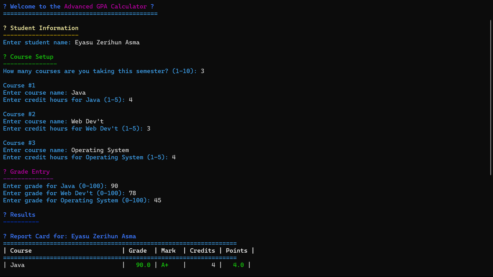
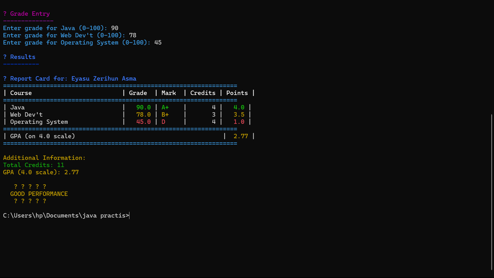

# 📊 GPA Calculator


A simple Java application to calculate your GPA with visual feedback.

## ✨ Features
- Grade input validation (A-F scale)
- Credit hour validation (1-5)
- Color-coded GPA results
- Simple terminal interface
- Supports up to 10 courses

## 🚀 Getting Started

### Prerequisites
- Java JDK 17 or higher
- Git (optional)
---

## 📷 Preview

> Below are sample screenshots of the GPA Calculator in action:

### 🖼️ Terminal View 1


### 🖼️ Terminal View 2


---

## 🚀 Features

- Color-coded terminal interface (using ANSI escape codes)
- Create a student and enter course details
- Add grades and credit hours
- GPA calculation on a **4.0 scale**
- Detailed report card with:
  - Letter grades
  - Grade points
  - Total credits
  - GPA summary
- Motivational ASCII art based on GPA performance 🎉

---

## 🛠️ How to Run

1. **Clone the repository**:
   ```bash
   git clone https://github.com/your-username/gpa-calculator.git
   cd gpa-calculator
``

2. **Compile the program**:

   ```bash
   javac GPACalculator.java
   ```

3. **Run the program**:

   ```bash
   java GPACalculator
   ```

> 💡 Make sure your terminal supports ANSI color codes for the best visual experience.

---

## 📁 File Structure

```
📦 gpa-calculator/
 ┣ GPACalculator.java
 ┣ README.md
 ┗ images/
    ┣ pic1.png
    ┗ pic2.png
```

---

## 📌 Notes

* Input validation ensures you can't enter invalid names, grades, or credit hours.
* The app handles up to **10 courses**, each with **1–5 credits**.
* GPA color feedback:

  * 🟢 Excellent (GPA ≥ 3.5)
  * 🟡 Good (GPA ≥ 2.5)
  * 🔴 Needs Improvement (GPA < 2.5)

---

## 📃 License

This project is open-source and free to use for educational purposes.

---

## ✍️ Author

* Developed by **\[Eyasu Zeruhun]**

Feel free to fork and contribute! 🎉

``

**Thank You🙋‍♂️**
